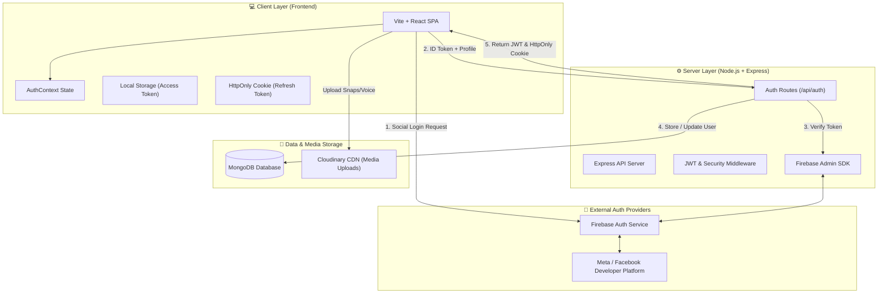
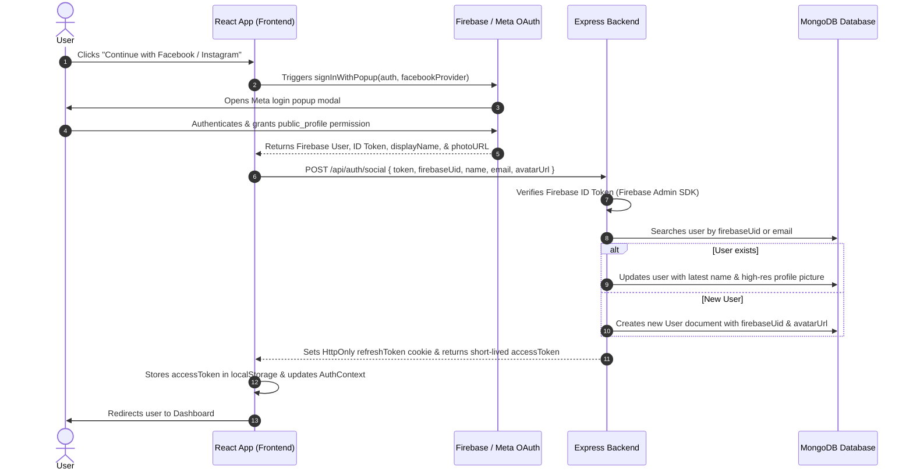
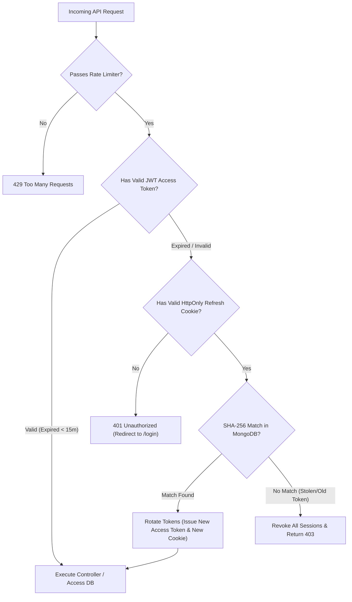

# 🏗️ loveforlove Architecture & Data Pipeline Visualization

This document details the complete end-to-end architecture, authentication flow, data storage pipeline, deployment structure, and **security architecture** for the **loveforlove** application.

---

## 1. System Overview Architecture

---

## 2. Authentication & OAuth Pipeline

Here is the exact step-by-step pipeline for how **Social Login (Google / Facebook / Instagram)** works:

---

## 3. 🛡️ Security Architecture & Protections

Here is a breakdown of all 6 layers of security built into **loveforlove**:

### 🔒 1. Cryptographic Token Verification (Anti-Spoofing)
- When a user logs in via Facebook/Instagram, the frontend receives an ID Token cryptographically signed by Firebase/Google.
- The backend uses `firebase-admin` SDK (`getAuth().verifyIdToken(token)`) to verify the token's RSA signature against Google's public keys.
- **Protection**: Attackers cannot fake or tamper with login payloads; any modified token is immediately rejected with `401 Unauthorized`.

### 🛡️ 2. Dual-Token JWT Architecture (Short-Lived Access + Long-Lived Refresh)
- **Access Token**: Short-lived (15 minutes). Used for API authorization header (`Authorization: Bearer <token>`).
- **Refresh Token**: Long-lived (30 days). Used solely to get a new access token via `/api/auth/refresh`.
- **Protection**: If an access token is intercepted, it becomes completely useless after 15 minutes.

### 🍪 3. HttpOnly & SameSite=Strict Cookies (XSS & CSRF Immune)
- The 30-day Refresh Token is stored as an **HttpOnly Cookie**.
- **XSS Protection**: `httpOnly: true` means client-side JavaScript (including browser extensions or injected scripts) **cannot read or steal** the token via `document.cookie`.
- **CSRF Protection**: `sameSite: 'strict'` prevents cross-site request forgery by ensuring browser never sends the cookie on third-party site requests.

### 🔑 4. SHA-256 Database Token Hashing (Zero Plaintext Tokens)
- Refresh tokens are **never stored in plain text** in the MongoDB database.
- Before saving to MongoDB, tokens are hashed using SHA-256 (`crypto.createHash('sha256').update(token).digest('hex')`).
- **Protection**: Even if an attacker gets full read access to the MongoDB database, they cannot use the hashed tokens to authenticate.

### 🔐 5. Bcrypt Password Hashing & Cryptographic Random Salts
- Standard user passwords are hashed using **Bcrypt with 12 salt rounds**.
- Social accounts generate a 40-character cryptographically random password (`crypto.randomBytes(20).toString('hex')`) so social accounts cannot be accessed via password endpoints.

### 🛑 6. Rate Limiting & Brute-Force Defense
- Custom rate limiters restrict authentication attempts:
  - `loginLimiter`: Max 5 failed login attempts per 15-minute window.
  - `registerLimiter`: Prevents automated account creation bots.
  - `refreshLimiter`: Prevents refresh token enumeration.

---

## 4. Security Flow Diagram

